<!-- profile:begin boot -->
<!-- generated by github-profile-designer; edits inside this block are overwritten -->

<!-- profile:end boot -->

<!-- profile:begin neofetch -->
<!-- generated by github-profile-designer; edits inside this block are overwritten -->
### `yuval@scojen:~$ neofetch`


<!-- profile:end neofetch -->

<!-- profile:begin snake -->
<!-- generated by github-profile-designer; edits inside this block are overwritten -->
### `yuval@scojen:~$ git-cal --snake`


<!-- profile:end snake -->

<!-- profile:begin lab -->
<!-- generated by github-profile-designer; edits inside this block are overwritten -->
### `yuval@scojen:~$ plate-reader --last 96d; systemctl status`

<table>
  <tr>
    <td valign="top"></td>
    <td valign="top"></td>
  </tr>
</table>

`xdg-open` [calculab.bio](https://www.calculab.bio/) · [built with Avichay Nahami](https://www.linkedin.com/in/avichay-nahami-48765a22b/)
<!-- profile:end lab -->

<!-- profile:begin stack -->
<!-- generated by github-profile-designer; edits inside this block are overwritten -->
### `yuval@scojen:~$ ls -F --color=auto ~/stack`


<!-- profile:end stack -->

<!-- profile:begin gitlog -->
<!-- generated by github-profile-designer; edits inside this block are overwritten -->
### `yuval@scojen:~$ git log --oneline --decorate --date=short`


<!-- profile:end gitlog -->

### `yuval@scojen:~$ cat ~/research.txt`

I am an undergraduate researcher at the Scojen Institute, Reichman University,
working on lab automation and synthetic biology under Ilana Kolodkin-Gal.

In 2026 I presented CalcuLab as a poster at FISEB (ILANIT) in Eilat, station 58,
under the title *A Comprehensive Web-Based Platform for Molecular Biology and
Biochemistry Calculations*. Most of the questions I got were about which
calculations people still do on paper, which is now the roadmap.

### `yuval@scojen:~$ ls ~/certs`

<details>
<summary><code>10 certificates, mostly IBM on Coursera</code></summary>

<br>

| Certificate | Issuer | Date |
| :-- | :-- | :-- |
| [Introduction to Containers with Docker, Kubernetes and OpenShift](https://www.coursera.org/account/accomplishments/records/A9G1IKTFIXAC) | IBM | Jun 2026 |
| [Django Application Development with SQL and Databases](https://www.coursera.org/account/accomplishments/records/74ZY10PWP5BM) | IBM | Jun 2026 |
| [Developing Back-End Apps with Node.js and Express](https://www.coursera.org/account/accomplishments/records/ZW4BZRQBE0RH) | IBM | Jun 2026 |
| [Developing Front-End Apps with React](https://www.coursera.org/account/accomplishments/records/FOPQJMDEE4XC) | IBM | Jun 2026 |
| [Introduction to Cloud Computing](https://www.coursera.org/account/accomplishments/records/6EI95MSNTOVR) | IBM | Jun 2026 |
| [Mental Health Development, Difficulties, and Disorders](https://www.coursera.org/account/accomplishments/records/A4DEZ9HO9N0B) | MedCerts | Mar 2026 |
| [Applied Software Engineering Fundamentals](https://www.coursera.org/account/accomplishments/specialization/5MLO8JXK67VJ) | IBM | Dec 2025 |
| [Developing AI Applications with Python and Flask](https://www.coursera.org/account/accomplishments/records/OXIR6RX9FPAU) | IBM | Dec 2025 |
| [Hands-on Introduction to Linux Commands and Shell Scripting](https://www.coursera.org/account/accomplishments/records/01V67ZGNASS9) | IBM | Dec 2025 |
| [Introduction to HTML, CSS, and JavaScript](https://www.coursera.org/account/accomplishments/records/QYRH69RLESZY) | IBM | Dec 2025 |

</details>

<!-- profile:begin finger -->
<!-- generated by github-profile-designer; edits inside this block are overwritten -->
### `yuval@scojen:~$ finger yuval`



`xdg-open` [LinkedIn](https://www.linkedin.com/in/yuvalkolodkin/) · [Email](mailto:yuvalkgal@gmail.com) · [calculab.bio](https://www.calculab.bio/)
<!-- profile:end finger -->

<!-- profile:begin install -->
<!-- generated by github-profile-designer; edits inside this block are overwritten -->
### `yuval@scojen:~$ curl -fsSL https://raw.githubusercontent.com/yuvalkolodkingal/yuvalkolodkingal/main/install.sh | sh`

Want a profile like this? That command installs two Agent Skills into every AI coding agent on your
machine (Claude Code, Codex, Cursor, Copilot, Gemini CLI, OpenCode and more). Then ask your agent:
"design my GitHub profile with github-profile-designer".

```sh
curl -fsSL https://raw.githubusercontent.com/yuvalkolodkingal/yuvalkolodkingal/main/install.sh | sh
# or: npx skills add yuvalkolodkingal/yuvalkolodkingal
# read first: curl -fsSLO https://raw.githubusercontent.com/yuvalkolodkingal/yuvalkolodkingal/main/install.sh && less install.sh && sh install.sh
```
<!-- profile:end install -->

<!-- profile:begin exit -->
<!-- generated by github-profile-designer; edits inside this block are overwritten -->
### `yuval@scojen:~$ exit`


<details>
<summary><code>man yuvalkolodkingal</code></summary>

**NAME**

yuvalkolodkingal - a GitHub profile rendered as one terminal session

**SYNOPSIS**

```sh
pip install -r skills/github-profile-designer/scripts/requirements.txt
python skills/github-profile-designer/scripts/build.py all
```

**DESCRIPTION**

Every panel on this page is an SVG generated by Python from `profile.toml` and committed to this
repository. Nothing is fetched from a stats service at view time, so there is no rate limit to hit and
no broken image when someone else's server goes down. Motion is CSS keyframes and SMIL inside each file,
which GitHub plays inside an image, and every animated panel has a still form for readers who prefer
reduced motion. A GitHub Actions job refreshes the data-driven panels daily.

**FILES**

| File | Made by | From | Refreshed |
| :-- | :-- | :-- | :-- |
| `boot.svg` | `render_boot.py` | profile.toml [boot] + build time | daily |
| `neofetch.svg` | `render_neofetch.py` | [neofetch] rows + data/github.json + data/contributions.json | daily |
| `snake.svg` | `render_snake.py` | data/contributions.json (public calendar, no token) | daily |
| `plate.svg` | `render_plate.py` | data/contributions.json, last 96 days | daily |
| `systemctl.svg` | `render_systemctl.py` | profile.toml [[projects]] | daily (uptime) |
| `stack.svg` | `render_stack.py` | profile.toml [stack] | on change |
| `gitlog.svg` | `render_gitlog.py` | profile.toml [[timeline]] | on change |
| `finger.svg` | `render_finger.py` | profile.toml [finger] + build time | daily |
| `exit.svg` | `render_exit.py` | profile.toml [exit] + build time | daily |

**SEE ALSO**

`skills/github-profile-designer/scripts/`, `install.sh`, `profile.toml`, `.github/workflows/`

</details>
<!-- profile:end exit -->
