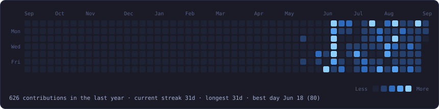

<div align="center">


<h3><code>yuval@github ~ $ ./contributions.sh</code></h3>



<br><br>

<h3><code>yuval@github ~ $ whoami</code></h3>

<table>
  <tr>
    <td valign="top"></td>
    <td valign="top"></td>
  </tr>
</table>

</div>

### `yuval@github ~ $ ls stack/`

<p align="center">
  
  
  
  <br/>
  
  
  
  <br/>
  
  
  
  
  <br/>
  
  
  
  
  
</p>

### `yuval@github ~ $ cat projects.md`

| Project | What it is |
| :-- | :-- |
| [**CalcuLab**](https://www.calculab.bio/) | A web platform for molecular biology and biochemistry calculations. Built so researchers stop redoing dilution and molarity arithmetic by hand, where a slipped decimal costs a whole experiment. Made with [Avichay Nahami](https://www.linkedin.com/in/avichay-nahami-48765a22b/) at the Scojen Institute. |

### `yuval@github ~ $ cat research.txt`

I am an undergraduate researcher at the Scojen Institute, Reichman University,
working on lab automation and synthetic biology under Ilana Kolodkin-Gal.

In 2026 I presented CalcuLab as a poster at FISEB (ILANIT) in Eilat, station 58,
under the title *A Comprehensive Web-Based Platform for Molecular Biology and
Biochemistry Calculations*. Most of the questions I got were about which
calculations people still do on paper, which is now the roadmap.

### `yuval@github ~ $ ls certifications/`

<details>
<summary>10 certificates, mostly IBM on Coursera</summary>

<br>

| Certificate | Issuer | Date |
| :-- | :-- | :-- |
| [Introduction to Containers with Docker, Kubernetes and OpenShift](https://www.coursera.org/account/accomplishments/records/A9G1IKTFIXAC) | IBM | Jun 2026 |
| [Django Application Development with SQL and Databases](https://www.coursera.org/account/accomplishments/records/74ZY10PWP5BM) | IBM | Jun 2026 |
| [Developing Back-End Apps with Node.js and Express](https://www.coursera.org/account/accomplishments/records/ZW4BZRQBE0RH) | IBM | Jun 2026 |
| [Developing Front-End Apps with React](https://www.coursera.org/account/accomplishments/records/FOPQJMDEE4XC) | IBM | Jun 2026 |
| [Introduction to Cloud Computing](https://www.coursera.org/account/accomplishments/records/6EI95MSNTOVR) | IBM | Jun 2026 |
| [Mental Health Development, Difficulties, and Disorders](https://www.coursera.org/account/accomplishments/records/A4DEZ9HO9N0B) | MedCerts | Mar 2026 |
| [Applied Software Engineering Fundamentals](https://www.coursera.org/account/accomplishments/specialization/5MLO8JXK67VJ) | IBM | Dec 2025 |
| [Developing AI Applications with Python and Flask](https://www.coursera.org/account/accomplishments/records/OXIR6RX9FPAU) | IBM | Dec 2025 |
| [Hands-on Introduction to Linux Commands and Shell Scripting](https://www.coursera.org/account/accomplishments/records/01V67ZGNASS9) | IBM | Dec 2025 |
| [Introduction to HTML, CSS, and JavaScript](https://www.coursera.org/account/accomplishments/records/QYRH69RLESZY) | IBM | Dec 2025 |

</details>

### `yuval@github ~ $ ./contact.sh`

<p align="center">
  <a href="https://www.linkedin.com/in/yuvalkolodkin/"></a>
  <a href="mailto:yuvalkgal@gmail.com"></a>
  <a href="https://www.calculab.bio/"></a>
</p>

<details>
<summary><code>yuval@github ~ $ cat .github/how-this-is-built</code></summary>

<br>

The animated art on this page is SVG generated by a script in
[`scripts/`](./scripts) and committed to this repo. The graph, the snake and
the header are not fetched from a stats service at render time, so there is no
rate limit to hit and no broken image icon when someone else's server goes
down. Only the flat tech and contact badges come from shields.io.

| File | Made by | Refreshed |
| :-- | :-- | :-- |
| `assets/snake.svg` | `fetch_contributions.py` then `render_snake_svg.py` | Daily, by GitHub Actions |
| `assets/typing-header.svg` | `make_typing_svg.py` | By hand, when the lines change |
| `assets/ascii-portrait.svg` | `make_ascii_svg.py` | By hand, when the art changes |
| `assets/info-card.svg` | `make_info_card.py` | By hand, when the details change |

The graph reads the public calendar at
`github.com/users/<username>/contributions`, which needs no API token, so the
snake eats real squares. The motion is CSS keyframes and SMIL inside each SVG,
because GitHub strips `<script>` from a README but does play animations in an
image.

```sh
pip install -r scripts/requirements.txt
python scripts/fetch_contributions.py
python scripts/render_snake_svg.py
```

</details>
